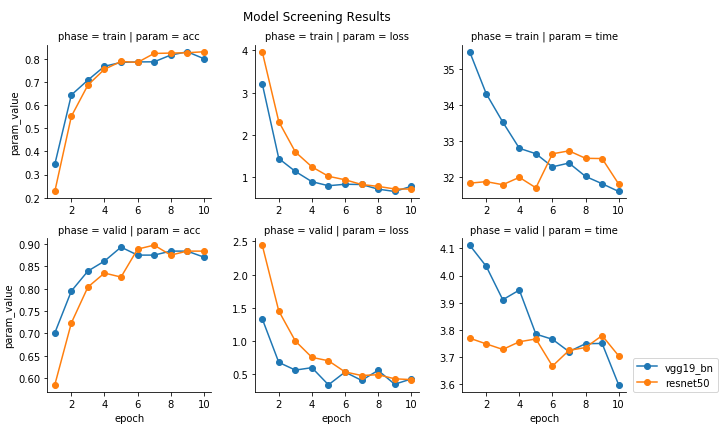
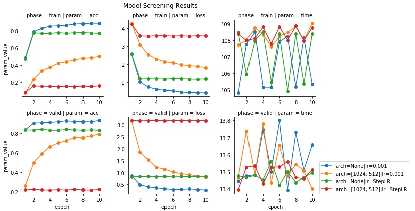

In this project, students first develop code for an image classifier built with PyTorch, then convert it into a command-line application.
"# flowers_calssifier" 

# Flower Image Recognition

### Table of Contents
1. [Project Motivation](#motivation)
2. [Results](#results)
4. [Installation](#installation)
3. [File Descriptions](#files)
5. [Licensing, Authors, and Acknowledgements](#licensing)

## Project Motivation<a name="motivation"></a>

The purpose of this project is to share how to develop an image recognition application in __Pytorch__. You can learn how to:
 1. load and preprocess the image dataset
 2. train the image classifier on dataset using [transfer learning](https://en.wikipedia.org/wiki/Transfer_learning)
 3. use the trained classifier to predict image content
 
The objective is to train an image classifier to recognize different species of flowers. Classifier is trained on [Dataset](http://www.robots.ox.ac.uk/~vgg/data/flowers/102/index.html) of 102 flower categories. 
 
## Results<a name="results"></a>

### Screening Models
There are two pre-trained models selected [VGG19_with batch normalization](https://pytorch.org/docs/stable/torchvision/models.html) and [Resent50](https://pytorch.org/docs/stable/torchvision/models.html). Both are subjected to transfer learning and performance is tested regarding model accuracy, loss and training time.

<div style="overflow: hidden; padding: 20px 0px">
    
</div>

Model resenet50 learns slower than model 'vgg19_bn' till epoch 6, but reaches in average higher accuracy from epoch 6 onward. It also reached the highest validation accuracy and in average lower prediction time, which can be beneficial in the production environment. This model will be further used for tuning using the whole training and validation dataset.

### Tunning Resent50
The number of hidden layers in classifier and learning rate were further tunned with following grid:

| Run     | Model     | Hidden Layers     | Learning Rate     |
|-----    |-------    |---------------    |---------------    |
| 1       | TBD       | None              | 0.001             |
| 2       | TBD       | None              | StepLR            |
| 3       | TBD       | [1024, 512]       | 0.001             |
| 4       | TBD       | [1024, 512]       | StepLR            |

<div style="overflow: hidden; padding: 20px 0px">
    
</div>

The number of layers and learning rate play a significant role in network learning. The model with classifier with none hidden layers is performing best, it learns fastest with learning rate 0.001 and reached the highest validation accuracy 93.3%.

## Installation <a name="installation"></a>

There are several necessary 3rd party libraries beyond the Anaconda distribution of Python which needs to be installed and imported to run code. These are:
 - [`torch`](https://pytorch.org/) Pytorch library for designing, training and testing neural networks in python
 - [torchvision](https://pytorch.org/docs/stable/torchvision/index.html) package consists of popular datasets, model architectures, and common image transformations for computer vision. It comes pre-installed with Pytroch.
 - [tqdm](https://tqdm.github.io/) progress bar to visualize ANN learning progress.
 
## File Descriptions <a name="files"></a>

There is 1 notebook available here to showcase work related to the above questions.  Markdown cells were used to assist in walking through the thought process for individual steps.  

There are additional files:
 - `train.py` will train a new network on a dataset and save the model as a checkpoint
 ```
 train.py --data_dir "/data/directory" --save_dir "/save/directory", --arch "resenet50" 
 ```
 - `predict.py` uses a trained network to predict the class for an input image
 ```
 prdict.py --image_dir "/image/directory" --load_dir "/model/directory" --top_k 5 --category_names "Mapping/to/category/names.json"
 ```
 -`model.py` Module for classes and functions related to neural network design, initialization and training
 
## Licensing, Authors, Acknowledgements<a name="licensing"></a>

Must give credit to Udacity for task design and [Maria-Elena Nilsback and Andrew Zisserman](http://www.robots.ox.ac.uk/~vgg/data/flowers/102/index.html) for the dataset.
